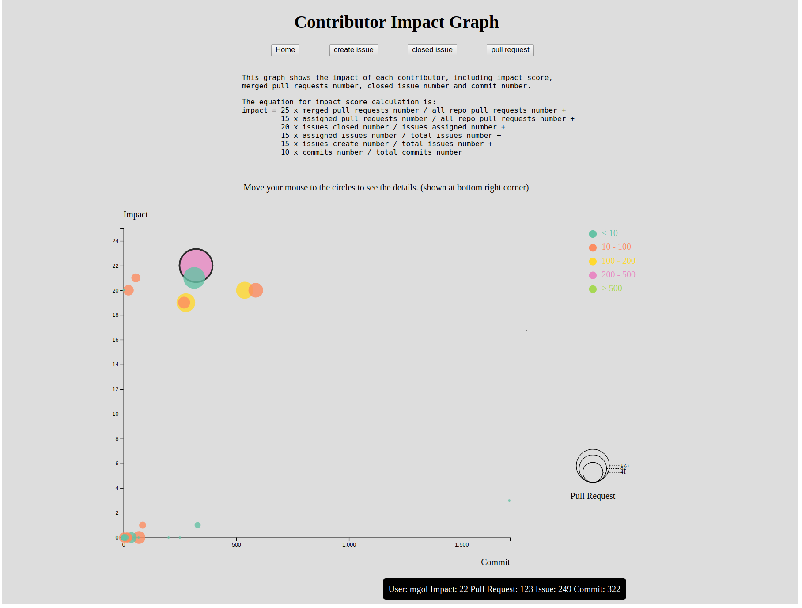

# final-project
    The final project of software engineering
    
    This project is to compare each contributor's impact on a specific repo. 
    An equation is created to measure the impact.

# requirement
    pip install PyGithub
    pip install flask

# how to use
    ***Before everytime search for a new repo, remember to clear the browser's cache***
    1. CLEAR BROWSER CACHE
    2. Run "python3 project.py" and copy the link to the browser.
    3. Input the username and repository name you want to search. (eg. jquery jquery)
    4. Click "Search" and wait until the page finish loading. (This normally takes a long time.)
    5. After it finish loading, click the page(graph) you want to have a look.
    6. Clicking buttons on each page can change the pages and can also link back to home page.
    ***if a correct repo is searched and not found page is shown, please check your internet before search again***

## data collection
    Data collected for a specific repo:

    contributors' names
    the total pull requests number
    the total issues number
    the total commits number

    Data collected for each contributors:

    total pull requests number
    closed pull requests number
    assigned pull requests number
    
    assigned issues number  (contributor is not author)
    closed issues number    (contributor is not author)
    created issue number    (contributor is author)

    the commit number on this repo

## the impact calculation equation for each contributor
    impact :

    25 x merged pull requests number / all repo pull requests number +
    15 x assigned pull requests number / all repo pull requests number +

    20 x issues closed number / issues assigned number +
    15 x assigned issues number / total issues number +
    15 x issues create number / total issues number +

    10 x commits number / total commits number 

# test result

the test input is username: jquery reponame: jquery

    
the output impact page

    
the output create issue page

    
the output closed issue page

    
the pull request page

